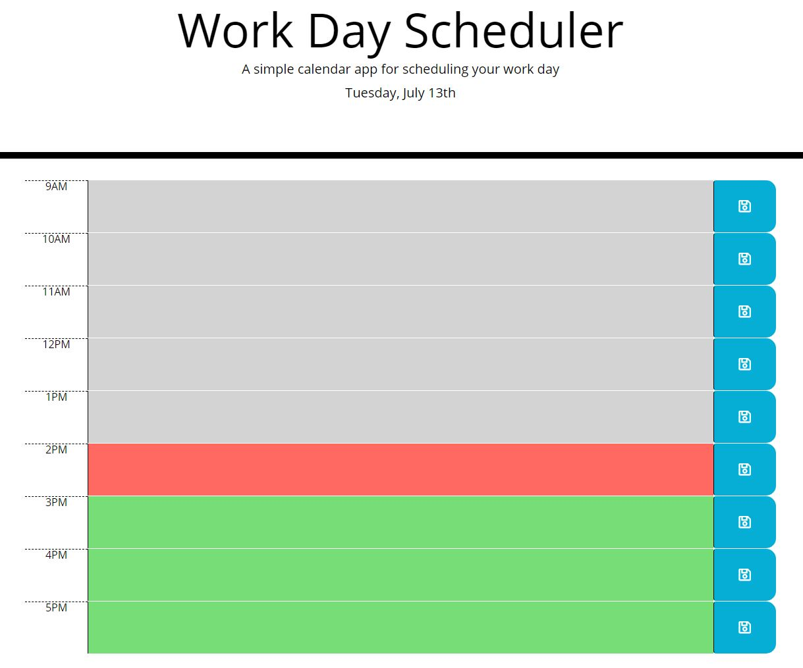
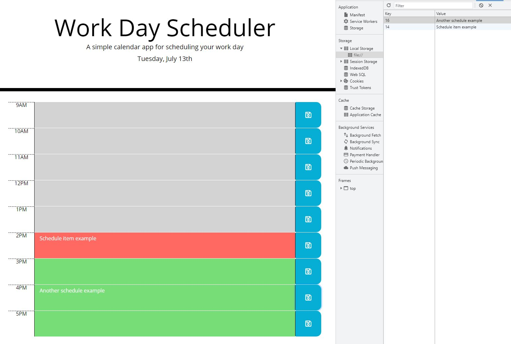

# Work-Planner

## Description

This app presents a work day planner with standard business hours for editing and saving. It presents rows for 9am-5pm by hours. Hours that have past that day display in grey, the current hour in red, and future hours in green. The current day and date are displayed above the planner. Users can enter text in each rows input field, and upon hitting the adjacent save button their input will be saved locally and displayed on page refresh.

## Usage

Below is what is displayed upon navigating to the app.

As said above, the user can enter text in the text fields between the hour label and save button. Clicking the save button saves to local storage and displays on page load. Example shown below with local storage displayed to the right.

This is a link of the deployed application: https://xanschwarz.github.io/Work-Planner/
